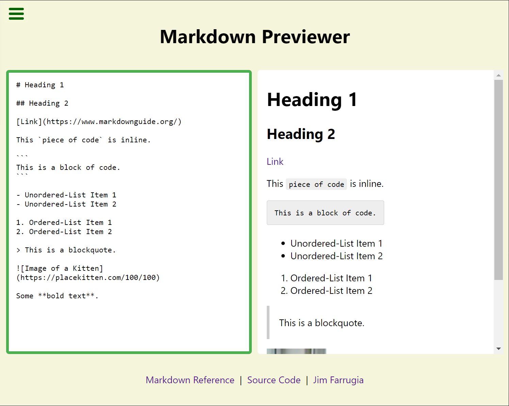

# Markdown Previewer



## Live Demo

[fcc-react-markdown-previewer.netlify.app](https://fcc-react-markdown-previewer.netlify.app/)

## What is Markdown?

> Markdown is a lightweight markup language for creating formatted text using a plain-text editor. John Gruber and Aaron Swartz created Markdown in 2004 as a markup language that is appealing to human readers in its source code form.

Source: [Wikipedia](https://en.wikipedia.org/wiki/Pomodoro_Technique)

You can learn more about Markdown and how to write it at [markdownguide.org](https://www.markdownguide.org/).

## Running the App Locally

### Prerequisites

You will need Node.js which can be downloaded [here](https://nodejs.org/).

### Installation

1. Download or clone this repository.

   ```sh
   git clone https://github.com/Jimfarrugia/react-markdown-previewer.git
   ```

2. Navigate to the project's root folder and run the following command to install the required NPM packages.

   ```sh
   npm install
   ```

3. Start the development server by running the following command.

   ```sh
   npm run start
   ```

4. If it does not open automatically, open the application in your web browser at the following address:
   ```
   localhost:3000
   ```
